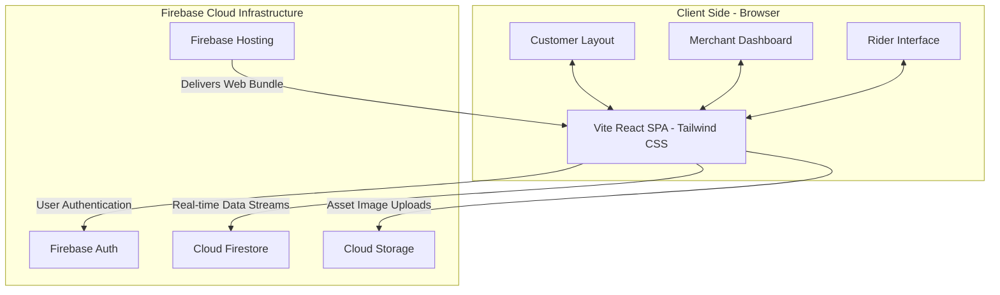

# CloudBites - Cloud-Based Food Tracking & Delivery Web App

CloudBites is a 100% software, cloud-native Food Tracking & Delivery Management web application designed as a B.Tech Cloud Computing mini-project. It showcases a modern React frontend styled with Tailwind CSS, integrated with Firebase's suite of managed cloud services (Authentication, Firestore, Cloud Storage, and static Hosting).

---

## 🚀 Key Features & Actor Roles

The application serves three distinct actors from a single React Single Page Application (SPA), dynamically rendering dashboards based on user roles:

1. **Customer**:
   - Browse menus of active restaurants, filter by custom food categories, and search dishes.
   - Manage a shopping cart (persisted in local storage and constrained to one restaurant at a time).
   - Checkout using Cash on Delivery (COD) and assign delivery address coordinates.
   - Track order delivery status in **real-time** on an interactive progress timeline (placed, accepted, preparing, ready for pickup, picked up, on the way, delivered).
   - View order transaction history.
   - Configure profile details and add/remove multiple delivery addresses.

2. **Restaurant Admin (Merchant)**:
   - Create and configure a restaurant profile (name, location, phone, description, and banner image).
   - CRUD management for food items (name, description, price, category, status, and custom food images).
   - Manage categories to structure menu lists.
   - Track and update incoming customer orders in real-time (Accept, Reject, Start Prep, Mark Ready for Pickup).
   - Outlet sales dashboard (total sales revenue, count of active/completed orders, and average ticket size).

3. **Delivery Agent (Rider)**:
   - View and claim active orders marked "Ready for Pickup".
   - Step-by-step delivery workflow: mark orders as "Picked Up", "On the Way", and "Delivered" (collecting COD payments).
   - Delivery earnings log (comissions computed from base deliveries + order tips).

---

## ☁️ Cloud Services Architecture

This project explicitly leverages multiple serverless cloud services instead of hosting a custom backend:

*   **Firebase Hosting**: Serves the React SPA globally over CDN with SSL enabled out-of-the-box.
*   **Firebase Authentication**: Secures signups/logins and handles identity session mapping.
*   **Cloud Firestore**: Real-time NoSQL database powering live sync between customers, restaurants, and riders.
*   **Cloud Storage**: Object storage bucket for uploading restaurant banners and food images.



---

## 🛠️ Installation & Quick Setup

To make the grading process seamless, this project contains a **Local Demo Mode**. If no Firebase credentials are found, the app automatically switches to an offline LocalStorage database initialized with rich mock data. 

### Prerequisites
- Node.js (v18 or higher recommended)
- npm (v9 or higher)

### Step 1: Install Dependencies
Clone the repository and run:
```bash
npm install
```

### Step 2: Configure Environment Variables (Optional for Cloud Mode)
To connect the application to your live Firebase Cloud, copy `.env.example` to `.env.local`:
```bash
cp .env.example .env.local
```
Fill in the configuration details from your Firebase Console.

*Note: If `.env.local` is missing or contains template values, the application will display a banner and run in **Local Demo Mode**.*

### Step 3: Run the Development Server
```bash
npm run dev
```
Open [http://localhost:5173](http://localhost:5173) in your browser.

### Step 4: Build for Production
```bash
npm run build
```

---

## 🎯 Academic Review Quick Login Credentials

If running in **Local Demo Mode**, the login screen includes quick buttons to auto-populate credentials for testing each actor. You can also type them manually:

| Role | Email | Password |
|---|---|---|
| **Customer** | `customer@test.com` | `password123` |
| **Restaurant Admin** | `admin@test.com` | `password123` |
| **Delivery Agent** | `delivery@test.com` | `password123` |

---

## 📊 Database Schema (NoSQL Cloud Firestore)

### Users Collection (`/users/{uid}`)
```json
{
  "uid": "String (Auth UID)",
  "name": "String",
  "email": "String",
  "phone": "String",
  "role": "customer | restaurant_admin | delivery_agent",
  "addresses": [
    { "id": "String", "name": "String", "details": "String", "phone": "String" }
  ],
  "createdAt": "Timestamp"
}
```

### Restaurants Collection (`/restaurants/{id}`)
```json
{
  "id": "String",
  "ownerId": "String (uid)",
  "name": "String",
  "description": "String",
  "location": "String",
  "phone": "String",
  "imageUrl": "String",
  "isActive": "Boolean",
  "createdAt": "Timestamp"
}
```

### FoodItems Collection (`/foodItems/{id}`)
```json
{
  "id": "String",
  "restaurantId": "String",
  "categoryId": "String",
  "name": "String",
  "description": "String",
  "price": "Number",
  "imageUrl": "String",
  "isAvailable": "Boolean",
  "createdAt": "Timestamp"
}
```

### Orders Collection (`/orders/{id}`)
```json
{
  "id": "String",
  "customerId": "String",
  "customerName": "String",
  "customerPhone": "String",
  "deliveryAddress": { "name": "String", "details": "String", "phone": "String" },
  "restaurantId": "String",
  "restaurantName": "String",
  "items": [
    { "itemId": "String", "name": "String", "quantity": "Number", "price": "Number" }
  ],
  "totalAmount": "Number",
  "status": "placed | accepted | preparing | ready_for_pickup | picked_up | on_the_way | delivered | cancelled",
  "assignedDeliveryAgentId": "String | null",
  "assignedDeliveryAgentName": "String | null",
  "paymentMethod": "cod",
  "paymentStatus": "pending | completed",
  "statusTimeline": [
    { "status": "String", "timestamp": "Timestamp", "note": "String" }
  ],
  "createdAt": "Timestamp",
  "updatedAt": "Timestamp"
}
```

---

## 🔒 Security Rules (Cloud Firestore)

To secure user records and order operations, configure the following rules in your Firestore Database console:

```javascript
rules_version = '2';
service cloud.firestore {
  match /databases/{database}/documents {
    
    // User rules
    match /users/{userId} {
      allow read: if request.auth != null;
      allow write: if request.auth != null && request.auth.uid == userId;
    }
    
    // Restaurant rules
    match /restaurants/{restId} {
      allow read: if true;
      allow write: if request.auth != null;
    }
    
    // Food items and categories
    match /foodItems/{itemId} {
      allow read: if true;
      allow write: if request.auth != null;
    }
    match /categories/{catId} {
      allow read: if true;
      allow write: if request.auth != null;
    }
    
    // Order rules
    match /orders/{orderId} {
      allow read: if request.auth != null;
      allow create: if request.auth != null;
      allow update: if request.auth != null;
    }
  }
}
```

---

## 📂 Project Directory Structure

```text
food-delivery-app/
├── src/
│   ├── assets/            # static assets
│   ├── components/        # shared navigation & protectors
│   │   ├── Layout.jsx
│   │   ├── PrivateRoute.jsx
│   │   └── StatusBadge.jsx
│   ├── config/            # Firebase SDK setup & seeded Local DB data
│   │   ├── firebase.js
│   │   └── mockData.js
│   ├── contexts/          # Context managers (Auth, Theme, Cart)
│   │   ├── AuthContext.jsx
│   │   ├── ThemeContext.jsx
│   │   └── CartContext.jsx
│   ├── pages/             # Pages by role
│   │   ├── auth/          # Login, Register
│   │   ├── customer/      # Home, Cart, Checkout, Profile, History, Tracking
│   │   ├── restaurant/    # Dashboard, Orders, MenuManagement, CategoryManagement
│   │   └── delivery/      # AssignedOrders, DeliveryHistory
│   ├── services/          # Dynamic Firestore/LocalStorage data bridges
│   │   ├── db.js
│   │   ├── authService.js
│   │   ├── userService.js
│   │   ├── restaurantService.js
│   │   ├── orderService.js
│   │   └── storageService.js
│   ├── App.jsx            # Routing configurations
│   ├── index.css          # Tailwind imports & variables
│   └── main.jsx           # Mounting logic
```
# project1-cloude
